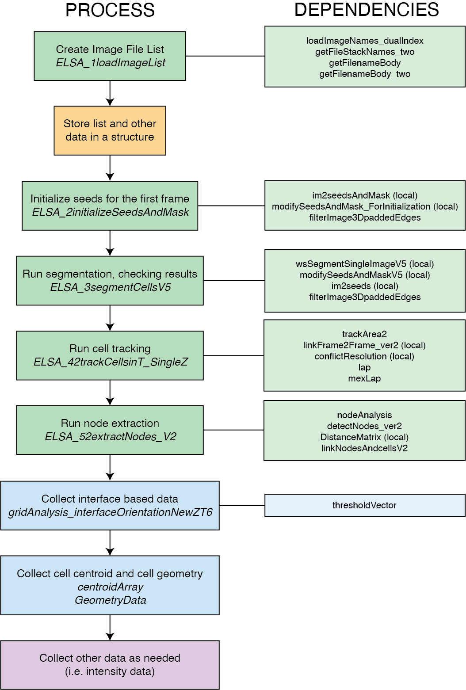

# segmentation-toolkit

The segmentation toolkit contains functions required for cell segmentation in drosophila embryo germband extension movies.

Cell segmentation is done using a [Watershed](https://www.mathworks.com/help/images/ref/watershed.html) transformation.

## Segmentation Flowchart


## Segmentation steps (2D):
1. Create image file list.
    - Navigate in Matlab to the folder location where the movie images are stored. This will be used as the path in the ELSA1 function.
    - The ELSA1 function will bring up a finder window. You need to select the first z layer of the first time point, then the first z layer of the second time point.

    ```matlab
    path = cd
    [imageFileList] = ELSA_1loadImageList(path)
    ```

    - ELSA1 function is dependent on `loadImageNames_dualIndex`, `getFileStackNames_two`, `getFilenameBody`, and `getFilenameBody_two` functions.

2. Store list and other data in a structure.
    - Important data to save would be at a minimum the ImageFileList, Source, SecPerFrame. Other data can include start and end of GBE, pixel size in microns, processed movies, etc.
    - Save the data structure in the Source folder.

    ```matlab
    data.ImageFileList = imageFileList
    data.Source = path
    data.SecPerFrame = 1
    save('data','data')
    ```

    - If the movie has been segmented and analyzed previously but you need to change the ImageFileList and Source, you can use the function `rewriteImageFileListAndSource`.
    - The 'oldString' and 'newString' inputs refer to portions of the path that need to be changed, the whole path does not need to be inputted.
    ```matlab
    [dataNew] = rewriteImageFileListAndSource(data,'oldString','newString')
    ```

3. Initialize seeds for the first movie frame.
    - The ELSA2 function will by default pick the first frame to initialize seeds, this can be changed in the code inputs.
    - The function will bring up an interactive image of seeds and mask which can be edited using the mouse and keyboard.
    ```matlab
    ELSA_2initializeSeedsAndMask(data)
    ```
    - ELSA2 function is dependent on `im2seedsAndMask` (local), `modifySeedsAndMask_ForInitialization` (local), and `filterImage3DpaddedEdges` functions.
4. Run segmentation and check the results every so often. Add seeds when cells are sufficiently in the frame.
    - The ELSA3 function gives options for the time period to segment (given in frames, i.e. [1:20]), as well as the check interval (number of frames before checking, i.e. 5). These will change depending on the movie to be segmented.
    - The function will bring up an interactive image of seeds and mask which can be edited. If there is a mistake, there is an "Undo" option which will revert the seeds of that frame to their original configuration.

    ```matlab
    ELSA_3segmentCellsV5(data,5,[1:20])
    ```

    - ELSA3 function is dependent on `wsSegmentSingleImageV5` (local), `modfiySeedsAndMaskV5` (local), `im2seeds` (local), and `filterImage3DpaddedEdges` functions. 
5. Run cell tracking.
    - The ELSA4 function will take the labeled cell images and track them over time so cell IDs are unique for the whole movie.
    - This function assumes using only one z-layer (2D segmentation).

    ```matlab
    ELSA_42trackCellsInT_SingleZ(data)
    ```

    - There is a function called that is written in C++ (`mexLap`). In order for it to run properly, the correct library must be used. For example, if running on a mac the extension `mexLap.mexmaci64` must be available on the computer. If the library is not available, you can compile it in Matlab using the mex function. For example, in Matlab the commands might look like: 

    ```matlab
    mex -setup C++
    mex mexLap.cpp
    ```


    - ELSA4 function is dependent on `trackArea2`, `linkFrame2Frame_ver2` (local), `conflictResolution` (local), `lap`, and `mexLap` functions.


6. Run node extraction.
    - The ELSA5 function gives the option for the time period to segment (given in frames, i.e. [1:20]). If this is not inputted, it will use the min and max available. It is important to note that if you segmented less than the full amount of available frames, you may run into an error if the time vector is higher.

    ```matlab
    ELSA_52extractNodes_V2(data,[1:20])
    ```

    - ELSA5 function is dependent on `nodeAnalysis`, `detectNodes_ver2`, `DistanceMatrix` (local), and `linkNodesAndcellsV2` functions.

7. Collect interface based data using the gridAnalysis function.
    - The gridAnalysis function gives the option for the first and last frame (i.e. [1 20]). If this is not inputted, it will use the min and max available. It is important to note that if you segmented less than the full amount of available frames, you may run into an error if the time vector is higher.
    - The gridAnalysis function gives the option for an angle vector. If you want all angles, this can be inputted as empty (i.e. []).

    ```matlab
    [matRes,trackingMatrixZT,trackingVectorLI] = gridAnalysis_interfaceOrientationNewZT6(data.Source,[], data.ImageFileList,[1 20])
    ```

    - gridAnalysis function is dependent on `thresholdVector` function.


8. Collect cell centroid and cell geometry (area and perimeter) data.
    - The centroidArray and GeometryData functions give the option for a movie number in case the data structure stores information for multiple movies. If only one movie is stored in the data structure, the input should just be 1.
    ```matlab
    centroidArray(data,1)
    ```
    ```matlab
    GeometryData(data,1)
    ```


9. Collect other data for additional analysis (i.e. intensity data).
    - This code is not included in the segmentation-toolkit.


10. Check results from segmentation and tracking as needed.
    - Results from segmentation can be checked retrospectively if needed (i.e. if downstream analysis is giving strange results).
    - The viewresults function will allow for checking the raw image, the tracking labels, the segmentation image, the segmentation lines overlaid on raw image, or the seeds and mask.
    - This function gives the option for frame delay (time interval between frames played back) and the time vector (specific frames to analyze, i.e. [1:20]).
    ```matlab
    viewresults(data,'raw',1,[1:20])
    ```
    - viewresults function is dependent on `imoverlay` (local) function.
